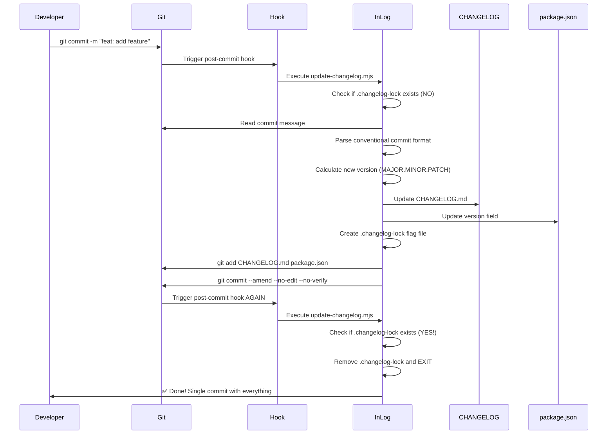

# InLog - Changelog System
## Complete Replication Guide

> **Professional Local-First Changelog Automation System**
>
> **Developed by:** Inmotion Software
> **Version:** 2.0
> **Approach:** Local Git hooks + Node.js script (NO external services)
> **Implementation Time:** 15-20 minutes

---

## 📋 Table of Contents

1. [What is InLog?](#what-is-inlog)
2. [System Architecture](#system-architecture)
3. [Requirements](#requirements)
4. [Step-by-Step Implementation](#step-by-step-implementation)
5. [Testing and Verification](#testing-and-verification)
6. [Customization](#customization)
7. [Troubleshooting](#troubleshooting)
8. [Why InLog?](#why-inlog)
9. [Advanced Usage](#advanced-usage)

---

## What is InLog?

**InLog** is a **100% local and automatic** changelog generation system that:

✅ **Auto-updates CHANGELOG.md** after every commit
✅ **Auto-increments version** in package.json (Semantic Versioning)
✅ **Single-commit workflow** using `git commit --amend` pattern
✅ **Prevents infinite loops** with flag file pattern
✅ **Zero external dependencies** (no GitHub Actions, Changesets, etc)
✅ **Supports Conventional Commits** (feat, fix, breaking changes)

### How It Works

```
You commit → Git hook triggers → Node.js script → Updates CHANGELOG + version → Amend includes everything in same commit
```

**Result:** One single commit with your code changes + updated changelog + incremented version!

---

## System Architecture

### Components Overview

```
your-project/
├── .husky/
│   └── post-commit              # Git hook executed after commit
├── scripts/
│   └── git/
│       └── update-changelog.mjs # Node.js script (InLog core)
├── .gitignore                   # Ignores .changelog-lock
├── CHANGELOG.md                 # Auto-generated/updated
└── package.json                 # Version auto-incremented
```

### Execution Flow



### Dependencies

| Library | Version | Purpose | Type |
|---------|---------|---------|------|
| **husky** | 9.1.7+ | Git hooks manager | devDependency |
| **Node.js built-ins** | - | fs, child_process, path | Native modules |

**IMPORTANT:** InLog uses **ZERO third-party libraries** for parsing or changelog generation. Everything is built with native Node.js modules!

---

## Requirements

### Mandatory

- **Node.js:** Version 18+ (uses ES modules)
- **Git:** Any modern version
- **npm/pnpm/yarn:** Package manager
- **package.json:** File in project root

### Knowledge Required

- Basic Git (commit, amend)
- Basic Node.js (running scripts)
- Conventional Commits format (`type: description`)

---

## Step-by-Step Implementation

### Step 1: Install and Configure Husky

```bash
# Navigate to your project root
cd your-project

# Install Husky as devDependency
npm install --save-dev husky
# or
pnpm add -D husky
# or
yarn add -D husky

# Initialize Husky (creates .husky/ folder)
npx husky init
# or
pnpm exec husky init
# or
yarn husky init
```

**What this does:**
- Installs Husky as dev dependency
- Creates `.husky/` folder with basic structure
- Adds `"prepare": "husky"` script to package.json

**Verify:**
```bash
ls -la .husky/
# Should show created folder with internal files
```

---

### Step 2: Create InLog Script

Create folder structure:

```bash
mkdir -p scripts/git
```

Create file `/scripts/git/update-changelog.mjs` with the following content:

```javascript
#!/usr/bin/env node

import { readFileSync, writeFileSync, existsSync, unlinkSync } from 'fs';
import { execSync } from 'child_process';
import { join } from 'path';

// ============================================================================
// CONFIGURATION
// ============================================================================

const PROJECT_ROOT = process.cwd();
const CHANGELOG_PATH = join(PROJECT_ROOT, 'CHANGELOG.md');
const PACKAGE_JSON_PATH = join(PROJECT_ROOT, 'package.json');
const FLAG_FILE = join(PROJECT_ROOT, '.changelog-lock');

// ============================================================================
// MAIN FUNCTION
// ============================================================================

function main() {
  // PREVENT INFINITE LOOP: Check if flag file exists (already amended)
  if (existsSync(FLAG_FILE)) {
    unlinkSync(FLAG_FILE);
    console.log('✅ Changelog already included in commit (preventing loop)');
    return;
  }

  console.log('🔄 Updating changelog and version...');

  // 1. Get last commit message
  const commitMessage = getLastCommitMessage();
  console.log(`📝 Commit: ${commitMessage}`);

  // 2. Parse commit type
  const { type, scope, description, body, isBreaking } = parseCommit(commitMessage);
  console.log(`🏷️  Type: ${type}${isBreaking ? ' (BREAKING)' : ''}`);

  // 3. Determine if version should be bumped
  if (!shouldBumpVersion(type)) {
    console.log('⏭️  No version bump needed for this commit type.');
    return;
  }

  // 4. Get current version
  const currentVersion = getCurrentVersion();
  console.log(`📦 Current version: ${currentVersion}`);

  // 5. Calculate new version
  const newVersion = calculateNewVersion(currentVersion, type, isBreaking);
  console.log(`✨ New version: ${newVersion}`);

  // 6. Update CHANGELOG.md
  updateChangelog(newVersion, type, scope, description, body);
  console.log('📄 CHANGELOG.md updated');

  // 7. Update package.json
  updatePackageJson(newVersion);
  console.log('📦 package.json updated');

  // 8. Create flag file to prevent loop on amend
  writeFileSync(FLAG_FILE, new Date().toISOString());

  // 9. Add files and amend commit
  execSync('git add CHANGELOG.md package.json', { stdio: 'ignore' });
  execSync('git commit --amend --no-edit --no-verify', { stdio: 'ignore' });
  console.log('✅ Changelog and version included in current commit');
}

// ============================================================================
// HELPER FUNCTIONS
// ============================================================================

/**
 * Get the last commit message
 */
function getLastCommitMessage() {
  try {
    return execSync('git log -1 --pretty=%B', { encoding: 'utf-8' }).trim();
  } catch (error) {
    console.error('❌ Error reading commit message:', error.message);
    process.exit(1);
  }
}

/**
 * Parse commit message
 * Format: type(scope): description
 * Example: feat(auth): add login page
 * Breaking: feat!: or fix!: or BREAKING CHANGE: in body
 */
function parseCommit(message) {
  // Check for breaking change
  const isBreaking = message.includes('!:') || message.includes('BREAKING CHANGE');

  // Split message into first line and body
  const lines = message.split('\n');
  const firstLine = lines[0];
  const body = lines.slice(1).join('\n').trim();

  // Extract type, scope, and description from first line
  const conventionalCommitRegex = /^(\w+)(\(([^)]+)\))?(!)?:\s*(.+)/;
  const match = firstLine.match(conventionalCommitRegex);

  if (!match) {
    return {
      type: 'unknown',
      scope: null,
      description: message,
      body: '',
      isBreaking: false,
    };
  }

  return {
    type: match[1],           // feat or fix
    scope: match[3] || null,  // optional scope
    description: match[5],    // commit title (first line)
    body: body,               // commit body (remaining lines)
    isBreaking: isBreaking,
  };
}

/**
 * Determine if commit type should trigger version bump
 * ONLY feat and fix are recognized
 */
function shouldBumpVersion(type) {
  return type === 'feat' || type === 'fix';
}

/**
 * Get current version from package.json
 */
function getCurrentVersion() {
  try {
    const packageJson = JSON.parse(readFileSync(PACKAGE_JSON_PATH, 'utf-8'));
    return packageJson.version || '0.1.0';
  } catch (error) {
    console.error('❌ Error reading package.json:', error.message);
    return '0.1.0';
  }
}

/**
 * Calculate new version (MAJOR.MINOR.PATCH format)
 * Breaking changes: increments MAJOR (0.1.0 → 1.0.0)
 * feat: increments MINOR (0.1.0 → 0.2.0)
 * fix: increments PATCH (0.1.0 → 0.1.1)
 */
function calculateNewVersion(currentVersion, type, isBreaking) {
  const [major, minor, patch] = currentVersion.split('.').map(Number);

  if (isBreaking) {
    // MAJOR: Breaking change (0.1.0 → 1.0.0)
    return `${major + 1}.0.0`;
  } else if (type === 'feat') {
    // MINOR: New feature (0.1.0 → 0.2.0)
    return `${major}.${minor + 1}.0`;
  } else {
    // PATCH: Bug fix (0.1.0 → 0.1.1)
    return `${major}.${minor}.${patch + 1}`;
  }
}

/**
 * Update CHANGELOG.md with new entry
 */
function updateChangelog(version, type, scope, description, body) {
  const date = new Date().toISOString().split('T')[0]; // YYYY-MM-DD
  const changeType = getChangeTypeLabel(type);
  const scopeText = scope ? `**${scope}:** ` : '';

  // Format the body: convert to indented bullet points if it contains line breaks
  let formattedBody = '';
  if (body && body.trim()) {
    const bodyLines = body.split('\n').filter(line => line.trim());
    formattedBody = bodyLines.map(line => {
      // If line already starts with -, keep it as is
      if (line.trim().startsWith('-')) {
        return `  ${line.trim()}`;
      }
      // Otherwise, add a bullet point
      return `  - ${line.trim()}`;
    }).join('\n');
  }

  // Create new entry
  const newEntry = `
## [${version}] - ${date}

### ${changeType}

- ${scopeText}${description}
${formattedBody ? '\n' + formattedBody : ''}
`;

  // Read existing changelog or create new one
  let changelog = '';
  if (existsSync(CHANGELOG_PATH)) {
    changelog = readFileSync(CHANGELOG_PATH, 'utf-8');
  } else {
    // Create initial CHANGELOG.md if it doesn't exist
    changelog = `# Changelog

All notable changes to this project will be documented in this file.

The format is based on [Keep a Changelog](https://keepachangelog.com/en/1.0.0/),
and this project adheres to [Semantic Versioning](https://semver.org/spec/v2.0.0.html).

`;
  }

  // Insert new entry after the header
  const lines = changelog.split('\n');
  const headerEndIndex = lines.findIndex(line => line.startsWith('##'));

  if (headerEndIndex === -1) {
    // No existing entries, append to end
    changelog += newEntry;
  } else {
    // Insert before first existing entry
    lines.splice(headerEndIndex, 0, newEntry.trim() + '\n');
    changelog = lines.join('\n');
  }

  writeFileSync(CHANGELOG_PATH, changelog);
}

/**
 * Get human-readable change type label
 */
function getChangeTypeLabel(type) {
  const labels = {
    feat: 'Features',
    fix: 'Bug Fixes',
  };
  return labels[type] || 'Changes';
}

/**
 * Update version in package.json
 */
function updatePackageJson(newVersion) {
  const packageJson = JSON.parse(readFileSync(PACKAGE_JSON_PATH, 'utf-8'));
  packageJson.version = newVersion;
  writeFileSync(PACKAGE_JSON_PATH, JSON.stringify(packageJson, null, 2) + '\n');
}

// ============================================================================
// RUN
// ============================================================================

main();
```

**Make the script executable:**

```bash
chmod +x scripts/git/update-changelog.mjs
```

---

### Step 3: Create Git Hook

Create file `.husky/post-commit` with the following content:

```bash
#!/usr/bin/env sh

# InLog - Changelog System by Inmotion
# Automatically updates CHANGELOG.md and package.json version after commit
node scripts/git/update-changelog.mjs
```

**Make the hook executable:**

```bash
chmod +x .husky/post-commit
```

---

### Step 4: Update .gitignore

Add to your `.gitignore`:

```gitignore
# InLog - Changelog automation
.changelog-lock
```

**Why?**
The `.changelog-lock` file is temporary and only used to prevent infinite loops. It should NOT be committed.

---

### Step 5: Create Initial CHANGELOG.md

**IMPORTANT:** This step creates the CHANGELOG.md file that stores all your version history.

**Option 1: Let InLog create it automatically**

The script will automatically create `CHANGELOG.md` on your first `feat:` or `fix:` commit if it doesn't exist.

**Option 2: Create it manually (recommended)**

Create the file now to have full control:

```bash
touch CHANGELOG.md
```

Add the standard header:

```markdown
# Changelog

All notable changes to this project will be documented in this file.

The format is based on [Keep a Changelog](https://keepachangelog.com/en/1.0.0/),
and this project adheres to [Semantic Versioning](https://semver.org/spec/v2.0.0.html).
```

**What is CHANGELOG.md used for?**

- 📄 **Single source of truth** for all version history
- 🔍 **Human-readable** format (Markdown)
- 🌐 **Can be used as backend** for public changelog pages
- 📦 **Distributed with your package** (included in npm/git)
- 🤖 **Auto-updated** by InLog after every commit

**Example of CHANGELOG.md after several commits:**

```markdown
# Changelog

All notable changes to this project will be documented in this file.

## [1.2.0] - 2025-11-05

### Features

- **api:** add pagination to user endpoints
- add export to CSV functionality

## [1.1.1] - 2025-11-04

### Bug Fixes

- resolve authentication token expiration issue

## [1.1.0] - 2025-11-03

### Features

- add dark mode support
```

---

### Step 6: Configure Initial Version in package.json

Ensure your `package.json` has a `version` field:

```json
{
  "name": "your-project",
  "version": "0.1.0",
  ...
}
```

If it doesn't exist, add it manually: `"version": "0.1.0"`.

---

## Testing and Verification

### Test 1: Commit with Feature

```bash
# Make some changes
echo "test" > test.txt
git add test.txt

# Commit with conventional commit format
git commit -m "feat: add test feature"

# Expected output:
# 🔄 Updating changelog and version...
# 📝 Commit: feat: add test feature
# 🏷️  Type: feat
# 📦 Current version: 0.1.0
# ✨ New version: 0.2.0
# 📄 CHANGELOG.md updated
# 📦 package.json updated
# ✅ Changelog and version included in current commit
```

**Verify:**

```bash
# See last commit
git log -1 --stat

# Should show:
# - test.txt (your change)
# - CHANGELOG.md (updated)
# - package.json (version 0.2.0)
```

**Check CHANGELOG.md:**

```bash
cat CHANGELOG.md

# Should contain:
# ## [0.2.0] - 2025-11-05
#
# ### Features
#
# - add test feature
```

---

### Test 2: Commit with Bug Fix

```bash
echo "fix" > fix.txt
git add fix.txt
git commit -m "fix: resolve login bug"

# Expected output:
# 📦 Current version: 0.2.0
# ✨ New version: 0.2.1
```

**Verify:**

```bash
cat package.json | grep version
# "version": "0.2.1"
```

---

### Test 3: Commit Without Bump (docs, chore, etc)

```bash
echo "docs" > README.md
git add README.md
git commit -m "docs: update readme"

# Expected output:
# ⏭️  No version bump needed for this commit type.
```

**Verify:**

```bash
cat package.json | grep version
# "version": "0.2.1"  (didn't change!)
```

---

### Test 4: Breaking Change

```bash
echo "breaking" > api.txt
git add api.txt
git commit -m "feat!: redesign authentication API"

# Expected output:
# 📦 Current version: 0.2.1
# ✨ New version: 1.0.0  (MAJOR bump!)
```

---

## Customization

### Add New Commit Types

Edit the `shouldBumpVersion` function in `update-changelog.mjs`:

```javascript
function shouldBumpVersion(type) {
  // Add 'perf' for performance improvements
  return type === 'feat' || type === 'fix' || type === 'perf';
}
```

And add the corresponding label:

```javascript
function getChangeTypeLabel(type) {
  const labels = {
    feat: 'Features',
    fix: 'Bug Fixes',
    perf: 'Performance Improvements', // New!
  };
  return labels[type] || 'Changes';
}
```

---

### Change Versioning Strategy

To change how versions are calculated, edit `calculateNewVersion`:

```javascript
function calculateNewVersion(currentVersion, type, isBreaking) {
  const [major, minor, patch] = currentVersion.split('.').map(Number);

  // Example: ALWAYS increment MAJOR for feat
  if (type === 'feat') {
    return `${major + 1}.0.0`;
  }

  // Or: only increment PATCH for everything
  if (type === 'fix' || type === 'feat') {
    return `${major}.${minor}.${patch + 1}`;
  }

  return currentVersion;
}
```

---

### Change Date Format

Edit the `updateChangelog` function:

```javascript
// Brazilian format: DD/MM/YYYY
const date = new Date().toLocaleDateString('pt-BR');

// Or more readable: November 5, 2025
const date = new Date().toLocaleDateString('en-US', {
  year: 'numeric',
  month: 'long',
  day: 'numeric'
});
```

---

### Disable Amend (Two Commits Instead of One)

If you prefer **two commits** (one with code, another with changelog), remove these lines from the script:

```javascript
// REMOVE these lines (lines 60-66):
writeFileSync(FLAG_FILE, new Date().toISOString());
execSync('git add CHANGELOG.md package.json', { stdio: 'ignore' });
execSync('git commit --amend --no-edit --no-verify', { stdio: 'ignore' });

// REPLACE with:
execSync('git add CHANGELOG.md package.json', { stdio: 'ignore' });
console.log('✅ CHANGELOG.md and package.json staged for next commit');
```

Then commit manually:

```bash
git commit -m "chore: update changelog"
```

**NOTE:** This is safer for collaborative projects where `git commit --amend` can cause issues.

---

## Troubleshooting

### Issue: Hook not executing

**Symptoms:** You commit but don't see script messages.

**Solution:**

```bash
# 1. Check if hook exists
ls -la .husky/post-commit

# 2. Make it executable
chmod +x .husky/post-commit

# 3. Check content
cat .husky/post-commit
# Should contain: node scripts/git/update-changelog.mjs

# 4. Test manually
node scripts/git/update-changelog.mjs
```

---

### Issue: Script not found

**Symptoms:** `Error: Cannot find module './scripts/git/update-changelog.mjs'`

**Solution:**

```bash
# 1. Check if script exists
ls -la scripts/git/update-changelog.mjs

# 2. Check permissions
chmod +x scripts/git/update-changelog.mjs

# 3. Test direct execution
node scripts/git/update-changelog.mjs
```

---

### Issue: Infinite loop (CHANGELOG with hundreds of entries)

**Symptoms:** CHANGELOG.md has dozens or hundreds of duplicate entries.

**Cause:** The `.changelog-lock` file was committed or is not in .gitignore.

**Solution:**

```bash
# 1. Stop any running processes (Ctrl+C)

# 2. Check .gitignore
grep "changelog-lock" .gitignore

# 3. If not there, add it
echo ".changelog-lock" >> .gitignore

# 4. Remove the flag file
rm -f .changelog-lock

# 5. Undo problematic commits
git reset --hard HEAD~10  # Go back before loop

# 6. Test with new commit
git commit -m "feat: test after fix"
```

---

### Issue: CHANGELOG not included in commit

**Symptoms:** `git log -1 --stat` doesn't show CHANGELOG.md or package.json.

**Cause:** Hook completed but `git commit --amend` failed.

**Solution:**

```bash
# 1. Check if files were modified
git status

# 2. If modified but not committed, amend manually
git add CHANGELOG.md package.json
git commit --amend --no-edit

# 3. Check script permissions
chmod +x scripts/git/update-changelog.mjs
```

---

### Issue: Version not being updated

**Symptoms:** package.json always shows the same version.

**Cause:** `version` field doesn't exist in package.json.

**Solution:**

```bash
# 1. Add manually to package.json
{
  "name": "your-project",
  "version": "0.1.0",  ← Add this line
  ...
}

# 2. Make a new commit
git commit -m "feat: test version bump"
```

---

### Issue: Parsing fails (commit message not recognized)

**Symptoms:** `🏷️ Type: unknown`

**Cause:** Commit message doesn't follow Conventional Commits format.

**Solution:**

Use the correct format:

```bash
# ✅ CORRECT
git commit -m "feat: add new feature"
git commit -m "fix: resolve bug"
git commit -m "fix(auth): resolve login issue"

# ❌ WRONG
git commit -m "added new feature"
git commit -m "bug fix"
git commit -m "Fixed the login"
```

---

## Why InLog?

### ✅ Compared to Changesets

| Aspect | InLog | Changesets |
|--------|-------|------------|
| Setup Time | 15 minutes | 30-60 minutes |
| Dependencies | Husky only | Changesets + CLI + Config |
| Complexity | Low (1 script) | High (complex workflow) |
| Workflow | Automatic | Manual (create changesets) |
| Commits | 1 commit (amend) | 2+ commits |
| Monorepos | Not supported | Native support |

**Conclusion:** For simple/medium projects, InLog is simpler and faster.

---

### ✅ Compared to GitHub Actions

| Aspect | InLog | GitHub Actions |
|--------|-------|----------------|
| Execution | Local (instant) | Remote (CI/CD) |
| External Dependencies | None | GitHub |
| Complexity | Low | Medium-High |
| Commits | 1 commit | 2+ commits (bot) |
| Privacy | 100% local | Public logs |
| Offline | Works | Doesn't work |

**Conclusion:** InLog is local-first and works offline.

---

### ✅ Compared to semantic-release

| Aspect | InLog | semantic-release |
|--------|-------|------------------|
| Setup | Simple | Complex |
| Dependencies | Husky | semantic-release + plugins |
| Size | ~250 lines | 1000+ lines |
| Control | Total | Limited (plugins) |
| Customization | Easy | Medium |

**Conclusion:** InLog is simpler and more customizable.

---

### ✅ Main Advantages

1. **Zero External Dependencies:** Only Husky + native Node.js
2. **100% Local:** Works offline, no CI/CD required
3. **Single Commit:** Changelog automatically included (via amend)
4. **Easy to Understand:** 250 lines of pure JavaScript
5. **Easy to Customize:** Edit the script directly
6. **No Lock-in:** Doesn't depend on proprietary services
7. **Fast:** Instant execution (local)
8. **Safe:** Flag file pattern prevents infinite loops

---

## Advanced Usage

### Using CHANGELOG.md as Backend for Public Pages

The CHANGELOG.md file can be used as a data source for public changelog pages:

**Next.js Example:**

```typescript
// app/changelog/page.tsx
import { promises as fs } from 'fs';
import path from 'path';
import { marked } from 'marked';

export default async function ChangelogPage() {
  const changelogPath = path.join(process.cwd(), 'CHANGELOG.md');
  const content = await fs.readFile(changelogPath, 'utf-8');
  const htmlContent = await marked.parse(content);

  return (
    <div className="container">
      <h1>Changelog</h1>
      <div
        className="prose"
        dangerouslySetInnerHTML={{ __html: htmlContent }}
      />
    </div>
  );
}
```

**API Route Example:**

```typescript
// app/api/changelog/route.ts
import { promises as fs } from 'fs';
import path from 'path';

export async function GET() {
  const changelogPath = path.join(process.cwd(), 'CHANGELOG.md');
  const content = await fs.readFile(changelogPath, 'utf-8');
  return Response.json({ content });
}
```

---

### Multi-line Commit Messages

InLog supports commit bodies with multiple lines:

```bash
git commit -m "feat: add user authentication

- Add login page with form validation
- Add registration flow with email verification
- Add password reset functionality
- Integrate with Supabase Auth
- Add protected route middleware"
```

**Result in CHANGELOG.md:**

```markdown
## [0.3.0] - 2025-11-05

### Features

- add user authentication
  - Add login page with form validation
  - Add registration flow with email verification
  - Add password reset functionality
  - Integrate with Supabase Auth
  - Add protected route middleware
```

---

### Conventional Commit Examples

```bash
# Features (MINOR bump)
git commit -m "feat: add user authentication"
git commit -m "feat(api): add pagination to endpoints"

# Bug Fixes (PATCH bump)
git commit -m "fix: resolve memory leak"
git commit -m "fix(ui): correct button alignment"

# Breaking Changes (MAJOR bump)
git commit -m "feat!: redesign authentication API"
git commit -m "fix!: change date format in API responses"

# No bump (ignored)
git commit -m "docs: update README"
git commit -m "chore: update dependencies"
git commit -m "refactor: restructure auth module"
git commit -m "test: add unit tests"
git commit -m "style: format code"
```

---

## Final Project Structure

After complete implementation:

```
your-project/
├── .husky/
│   ├── _/                       # Husky internal files
│   └── post-commit              # ✅ Hook that executes script
├── scripts/
│   └── git/
│       └── update-changelog.mjs # ✅ InLog core script
├── .gitignore                   # ✅ Ignores .changelog-lock
├── CHANGELOG.md                 # ✅ Auto-generated changelog
├── package.json                 # ✅ Auto-updated version
└── node_modules/
    └── husky/                   # ✅ Only external dependency
```

---

## Implementation Checklist

### Installation

- [ ] Husky installed (`npm install --save-dev husky`)
- [ ] Husky initialized (`npx husky init`)
- [ ] Script `"prepare": "husky"` exists in package.json

### Files Created

- [ ] `/scripts/git/update-changelog.mjs` exists and is executable
- [ ] `.husky/post-commit` exists and is executable
- [ ] `.gitignore` contains `.changelog-lock`
- [ ] `CHANGELOG.md` exists with proper header
- [ ] `package.json` has `version` field

### Tests

- [ ] Test 1: `git commit -m "feat: test"` increments MINOR
- [ ] Test 2: `git commit -m "fix: test"` increments PATCH
- [ ] Test 3: `git commit -m "docs: test"` doesn't increment version
- [ ] Test 4: `git log -1 --stat` shows CHANGELOG.md and package.json
- [ ] Test 5: No infinite loop occurs

### Final Checks

- [ ] `.changelog-lock` is in .gitignore
- [ ] CHANGELOG.md is being updated correctly
- [ ] package.json version is being incremented
- [ ] Single commit contains code + changelog + version
- [ ] Script messages appear in terminal

---

## Resources

### Links

- [Conventional Commits](https://www.conventionalcommits.org/) - Official specification
- [Semantic Versioning](https://semver.org/) - Versioning specification
- [Keep a Changelog](https://keepachangelog.com/) - Changelog format
- [Husky](https://typicode.github.io/husky/) - Official documentation

---

## About InLog

**InLog - Changelog System** is a professional tool developed by **Inmotion Software** for automated changelog management.

**Version:** 2.0
**Author:** Inmotion Software
**License:** Proprietary - Can be used freely in Inmotion projects

**Key Features:**
- ✅ 100% Local (no external services)
- ✅ Single-commit workflow
- ✅ Zero configuration
- ✅ Easy to customize
- ✅ Production-ready

---

## Conclusion

Congratulations! You now have **InLog** - a fully functional and 100% local changelog system.

**Next Steps:**
1. Make some test commits
2. Check generated CHANGELOG.md
3. Customize the script as needed
4. Share with your team

**Remember:**
- Use Conventional Commits (`feat:`, `fix:`)
- Wait for hook to complete before `git push`
- System works with any package manager (npm, pnpm, yarn)

**Happy coding with InLog! 🚀**

---

*InLog - Changelog System by Inmotion Software*
